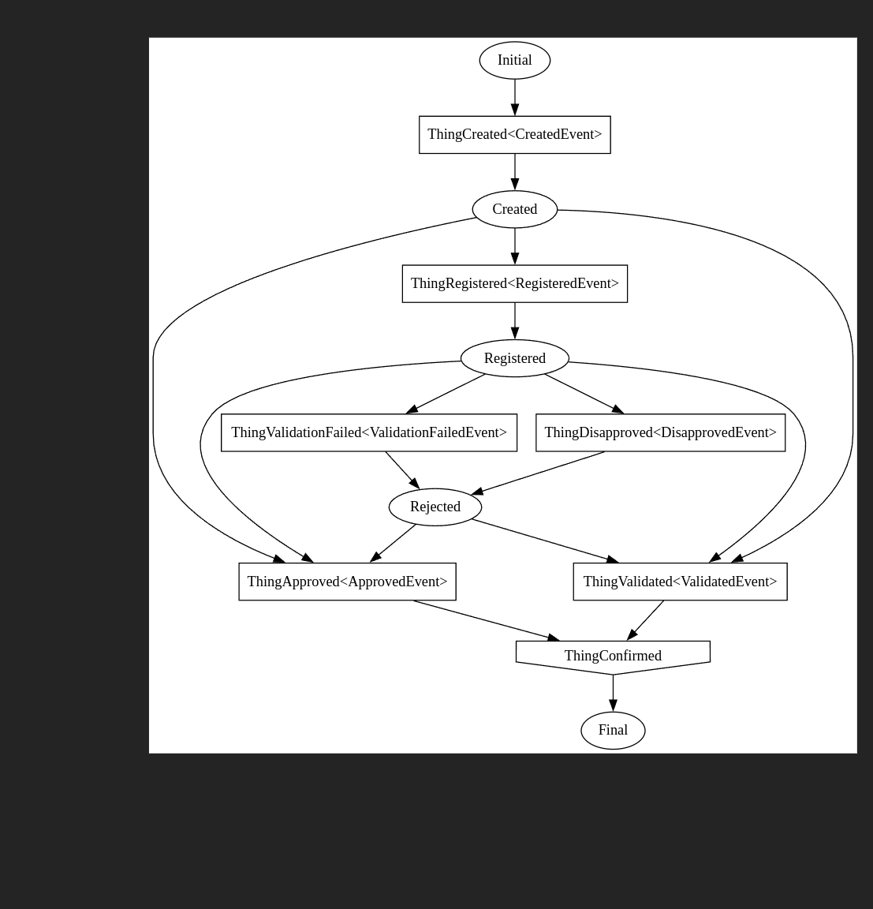

# Repro of state machine graph issue

State machine code in MyStateMachine.  
Program.cs only prints the dotfile format graph.  

Visualization tool used:  https://www.devtoolsdaily.com/graphviz/  

**Expectation: Created and Rejected nodes are not connected to `ThingApproved` and `ThingValidated`**

Actual:

